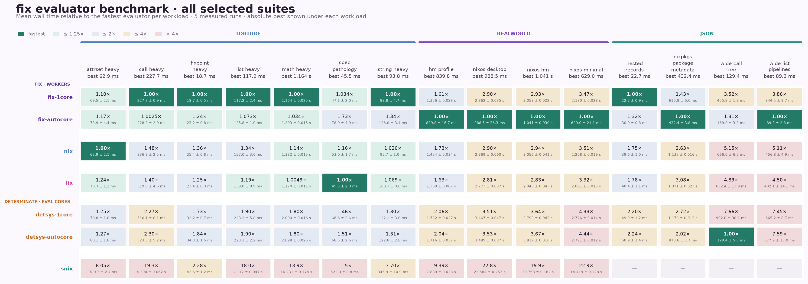

# fix

`fix` is a fast, parallel evaluator and command-line tool for the Nix language,
written in Zig.

It is a from-scratch implementation, not a wrapper around the Nix evaluator.
`fix` parses Nix source, compiles it to bytecode, evaluates expressions lazily,
computes derivations and store paths, and speaks the Nix daemon protocol for
store operations and builds. It is intended to run existing Nix expressions
and produce the same values and derivations while making evaluation faster.

`fix` also treats the evaluator as something you should be able to inspect. It
includes a heap and bytecode explorer, a source-level debugger, an interactive
REPL, evaluation statistics, and Perfetto-compatible traces.


## What is different

### Parallel lazy evaluation

`fix` can evaluate thunk work on multiple worker threads. A thunk contains a
`Future`: one fiber claims an unresolved thunk, while another fiber that reaches
the same in-flight thunk can park and let its worker run something else.
Speculative forcing and strict-demand fan-out provide work for otherwise idle
workers; both can be disabled when diagnosing parallel behavior.

The worker count is configurable, including a single-worker mode when
repeatability or debugging matters more than throughput.

### Compatibility you can measure

Compatibility is a target backed by several kinds of tests:

- Derivation tests cover canonical ATerm serialization, hashing, string
  context, and expected `.drv` and output store paths.
- The pinned Lix and snix language suites compare evaluation and parse results.
- A separate differential test evaluates every benchmark fixture with `fix`
  and a reference Nix, then compares the strict JSON results structurally.
- `fix parse` emits the same JSON-shaped syntax tree used by
  `nix-instantiate --parse`.

The current pinned language suites pass. See
[the language-test documentation](test/lang/README.md) for exactly what is run.

### An evaluator you can look inside

The VM explorer and debugger are part of `fix`, rather than separate
instrumented builds. They operate on the real compiler, bytecode, stacks,
thunks, and heap used by ordinary evaluations.

The explorer can move from source expressions to compiled chunks and
instructions, inspect heap objects and their references, search stores, and set
breakpoints. Large chunk and object collections are represented with range
nodes and bounded queries rather than one UI row per entry.

The debugger supports:

- pending and resolved source-line breakpoints;
- `builtins.break` and stops on evaluation errors;
- step, next, finish, and continue;
- lexical locals, captured values, the operand stack, and annotated bytecode;
- evaluating a Nix expression in the scope of the current pause; and
- opening the VM explorer without leaving the debugging session.

`fix eval --debugger` and `fix repl --debugger` use one worker. A transient
`:debug` session in an ordinary REPL temporarily disables parallel submissions.


This demo first evaluates a NixOS toplevel, then starts a debugger session while
that evaluation's heap remains available to inspect.


## Quick start

The packaged build currently targets Linux. Nix is required to build `fix`, and
commands that write to or realize the store require a reachable Nix daemon.
Build it from the repository with:

```console
$ git clone https://github.com/psyclyx/fix
$ cd fix
$ nix-build -A fix
```

The executable is `result/bin/fix`:

```console
$ ./result/bin/fix eval -E '1 + 2'
3

$ ./result/bin/fix build -f default.nix -A fix

$ ./result/bin/fix repl
```

The package also includes shell completions for Bash, Fish, and Zsh.

## What it can do

`fix` covers the common path from evaluating an expression to realizing and
running its output:

| Command | Purpose |
| --- | --- |
| `fix eval` | Evaluate expressions, files, attributes, or flake outputs |
| `fix instantiate` | Evaluate derivations and write their `.drv` files |
| `fix build` | Evaluate and build derivations, with result links and GC roots |
| `fix run` | Build an installable and run its declared program |
| `fix shell` | Enter a shell containing selected packages |
| `fix print-dev-env` | Emit a derivation's build environment as a shell script |
| `fix repl` | Evaluate interactively and enter the explorer or debugger |
| `fix parse` | Parse Nix and emit a compatible JSON syntax tree |
| `fix disasm` | Compile an expression and print its bytecode |
| `fix flake` | Show, check, lock, update, and inspect flake metadata |
| `fix switch` | Build and activate a system or user configuration |
| `fix completions` | Generate shell completions |

Run `fix <command> --help` for the documented inputs and options.

### Evaluate, instantiate, and build

Commands accept expressions, files, attribute paths, and repeated mixed inputs:

```console
$ fix eval -E '{ answer = 6 * 7; }' -A answer
42

$ fix eval --strict --json ./packages.nix

$ fix instantiate -f default.nix -A fix
/nix/store/...-fix.drv

$ fix build -f default.nix -A fix
```

Arguments can be supplied with `--arg` and `--argstr`. Evaluation can produce
Nix, JSON, XML, or raw output, and can be made strict. Builds can target the
local daemon or remote `ssh-ng://` and `tcp://` stores.

### Run programs and open temporary shells

```console
$ fix run --flake nixpkgs#hello

$ fix shell -p ripgrep jq
```

`fix run` builds the selected installable and chooses its executable from
`meta.mainProgram`, `pname`, or `name`. `fix shell` constructs and realizes an
environment containing the requested packages.

Flake commands require Nix's `flakes` experimental feature. Enable it in
`nix.conf`, or pass it for an invocation:

```console
$ fix flake show . --extra-experimental-features flakes
```

### Development environments and direnv

`fix print-dev-env` evaluates a derivation and prints a Bash program that
reconstructs its build environment without building the derivation:

```console
$ eval "$(fix print-dev-env ./shell.nix)"
```

The included direnv integration provides `use fix` and `use fix_flake`. See
[the direnv documentation](contrib/direnv/README.md) for installation and
options.

### `fix switch`

`fix switch` can build and activate NixOS configurations. It also implements
the conventional nix-darwin and Home Manager activation paths, although those
two have not been verified locally. It supports `switch`, `boot`, `test`,
`build`, and `dry-activate` actions, as well as remote activation with
`--target-host`. When supplied, the action must be the first argument after
`fix switch`.

```console
$ fix switch --nixos

$ fix switch build --home-manager --flake .#me

$ fix switch --nixos --target-host host.example
```

This command is intentionally experimental. I am still thinking about what
exactly `fix switch` should be—its scope, its interface, and its relationship to
the existing rebuild tools—and it will likely change in the future. Treat the
current command as a useful prototype, not a stable automation interface.

## Explorer and debugger

Start the REPL with `fix repl`. From there:

- `:vm` opens the full-screen VM explorer;
- `:d EXPR` evaluates an expression in the debugger; and
- `:help` lists the available REPL commands.

The debugger can also be enabled directly on an evaluation:

```console
$ fix eval --debugger ./expression.nix
```

Inside the debugger, `break FILE:LINE` adds a source breakpoint. A breakpoint
may remain pending until that source is compiled; it resolves automatically
when the matching code appears. `breakpoints` lists breakpoints and `delete N`
removes one.

Both tools also have bounded text output for non-interactive use. Start the REPL
with `fix repl --no-tui` when an alternate-screen interface is undesirable.

## Performance

The chart below compares wall-clock evaluation time across synthetic stress
tests, real NixOS and Home Manager configurations, and JSON-producing
workloads. Each cell is relative to the fastest evaluator for that workload;
`1.00×` is fastest. The harness defaults to five recorded runs.



<details>
<summary>Full benchmark tables</summary>

### Torture

#### `attrset-heavy`

| Command | Mean [ms] | Min [ms] | Max [ms] | Relative |
|:---|---:|---:|---:|---:|
| `fix-1core` | 69.5 ± 2.1 | 66.7 | 71.8 | 1.10 ± 0.05 |
| `fix-autocore` | 73.9 ± 4.4 | 69.3 | 78.4 | 1.17 ± 0.08 |
| `nix` | 62.9 ± 2.1 | 61.4 | 66.4 | 1.00 |
| `lix` | 78.3 ± 1.1 | 76.4 | 79.0 | 1.24 ± 0.05 |
| `detsys-1core` | 78.8 ± 1.8 | 76.9 | 81.8 | 1.25 ± 0.05 |
| `detsys-autocore` | 80.1 ± 1.8 | 78.2 | 82.4 | 1.27 ± 0.05 |
| `snix` | 380.3 ± 2.4 | 376.8 | 383.7 | 6.05 ± 0.21 |

#### `call-heavy`

| Command | Mean [ms] | Min [ms] | Max [ms] | Relative |
|:---|---:|---:|---:|---:|
| `fix-1core` | 227.7 ± 0.9 | 226.7 | 228.9 | 1.00 |
| `fix-autocore` | 228.3 ± 2.9 | 224.4 | 231.8 | 1.00 ± 0.01 |
| `nix` | 336.8 ± 2.5 | 334.7 | 339.6 | 1.48 ± 0.01 |
| `lix` | 319.8 ± 4.6 | 315.0 | 325.4 | 1.40 ± 0.02 |
| `detsys-1core` | 516.1 ± 8.1 | 504.5 | 524.4 | 2.27 ± 0.04 |
| `detsys-autocore` | 523.3 ± 5.2 | 514.8 | 528.7 | 2.30 ± 0.02 |
| `snix` | 4389.5 ± 62.5 | 4329.8 | 4488.5 | 19.28 ± 0.29 |

#### `fixpoint-heavy`

| Command | Mean [ms] | Min [ms] | Max [ms] | Relative |
|:---|---:|---:|---:|---:|
| `fix-1core` | 18.7 ± 0.5 | 18.1 | 19.1 | 1.00 |
| `fix-autocore` | 23.2 ± 0.8 | 22.4 | 24.4 | 1.24 ± 0.05 |
| `nix` | 25.4 ± 0.8 | 24.5 | 26.2 | 1.36 ± 0.05 |
| `lix` | 23.4 ± 0.3 | 23.0 | 23.8 | 1.25 ± 0.04 |
| `detsys-1core` | 32.2 ± 0.7 | 31.7 | 33.4 | 1.73 ± 0.06 |
| `detsys-autocore` | 34.3 ± 1.5 | 33.1 | 36.8 | 1.84 ± 0.09 |
| `snix` | 42.6 ± 1.2 | 41.2 | 44.5 | 2.28 ± 0.09 |

#### `list-heavy`

| Command | Mean [ms] | Min [ms] | Max [ms] | Relative |
|:---|---:|---:|---:|---:|
| `fix-1core` | 117.2 ± 2.4 | 115.5 | 121.5 | 1.00 |
| `fix-autocore` | 125.8 ± 1.0 | 124.7 | 127.1 | 1.07 ± 0.02 |
| `nix` | 157.0 ± 3.0 | 153.7 | 161.8 | 1.34 ± 0.04 |
| `lix` | 139.0 ± 0.9 | 137.9 | 139.9 | 1.19 ± 0.03 |
| `detsys-1core` | 223.2 ± 5.8 | 218.2 | 231.2 | 1.90 ± 0.06 |
| `detsys-autocore` | 223.3 ± 2.2 | 220.3 | 226.4 | 1.90 ± 0.04 |
| `snix` | 2111.9 ± 47.1 | 2048.6 | 2168.1 | 18.01 ± 0.55 |

#### `math-heavy`

| Command | Mean [s] | Min [s] | Max [s] | Relative |
|:---|---:|---:|---:|---:|
| `fix-1core` | 1.164 ± 0.025 | 1.128 | 1.193 | 1.00 |
| `fix-autocore` | 1.203 ± 0.015 | 1.187 | 1.222 | 1.03 ± 0.03 |
| `nix` | 1.332 ± 0.015 | 1.309 | 1.347 | 1.14 ± 0.03 |
| `lix` | 1.170 ± 0.011 | 1.151 | 1.178 | 1.00 ± 0.02 |
| `detsys-1core` | 2.090 ± 0.016 | 2.063 | 2.105 | 1.80 ± 0.04 |
| `detsys-autocore` | 2.098 ± 0.025 | 2.057 | 2.125 | 1.80 ± 0.04 |
| `snix` | 16.231 ± 0.174 | 16.084 | 16.448 | 13.94 ± 0.33 |

#### `spec-pathology`

| Command | Mean [ms] | Min [ms] | Max [ms] | Relative |
|:---|---:|---:|---:|---:|
| `fix-1core` | 47.1 ± 2.0 | 45.4 | 50.3 | 1.03 ± 0.06 |
| `fix-autocore` | 78.9 ± 4.9 | 73.3 | 85.6 | 1.73 ± 0.13 |
| `nix` | 53.0 ± 1.7 | 50.6 | 55.0 | 1.16 ± 0.06 |
| `lix` | 45.5 ± 2.0 | 42.8 | 48.1 | 1.00 |
| `detsys-1core` | 66.6 ± 3.6 | 63.8 | 72.9 | 1.46 ± 0.10 |
| `detsys-autocore` | 68.5 ± 2.6 | 64.6 | 71.9 | 1.51 ± 0.09 |
| `snix` | 522.0 ± 8.8 | 511.6 | 530.7 | 11.47 ± 0.54 |

#### `string-heavy`

| Command | Mean [ms] | Min [ms] | Max [ms] | Relative |
|:---|---:|---:|---:|---:|
| `fix-1core` | 93.8 ± 4.7 | 87.3 | 98.8 | 1.00 |
| `fix-autocore` | 126.0 ± 3.1 | 121.3 | 129.2 | 1.34 ± 0.08 |
| `nix` | 95.7 ± 1.0 | 94.1 | 96.4 | 1.02 ± 0.05 |
| `lix` | 100.3 ± 0.6 | 99.6 | 101.1 | 1.07 ± 0.05 |
| `detsys-1core` | 122.1 ± 3.0 | 119.8 | 127.2 | 1.30 ± 0.07 |
| `detsys-autocore` | 122.8 ± 2.8 | 119.3 | 127.0 | 1.31 ± 0.07 |
| `snix` | 346.9 ± 10.9 | 339.2 | 365.2 | 3.70 ± 0.22 |

### Real-world configurations

#### `hm-profile`

| Command | Mean [s] | Min [s] | Max [s] | Relative |
|:---|---:|---:|---:|---:|
| `fix-1core` | 1.356 ± 0.028 | 1.334 | 1.395 | 1.61 ± 0.05 |
| `fix-autocore` | 0.840 ± 0.017 | 0.821 | 0.862 | 1.00 |
| `nix` | 1.454 ± 0.034 | 1.409 | 1.503 | 1.73 ± 0.05 |
| `lix` | 1.369 ± 0.007 | 1.358 | 1.376 | 1.63 ± 0.03 |
| `detsys-1core` | 1.732 ± 0.027 | 1.708 | 1.762 | 2.06 ± 0.05 |
| `detsys-autocore` | 1.716 ± 0.037 | 1.672 | 1.754 | 2.04 ± 0.06 |
| `snix` | 7.889 ± 0.028 | 7.860 | 7.925 | 9.39 ± 0.19 |

#### `nixos-desktop`

| Command | Mean [s] | Min [s] | Max [s] | Relative |
|:---|---:|---:|---:|---:|
| `fix-1core` | 2.862 ± 0.035 | 2.820 | 2.912 | 2.90 ± 0.11 |
| `fix-autocore` | 0.988 ± 0.036 | 0.944 | 1.035 | 1.00 |
| `nix` | 2.869 ± 0.060 | 2.805 | 2.947 | 2.90 ± 0.12 |
| `lix` | 2.773 ± 0.037 | 2.721 | 2.805 | 2.81 ± 0.11 |
| `detsys-1core` | 3.467 ± 0.047 | 3.415 | 3.538 | 3.51 ± 0.14 |
| `detsys-autocore` | 3.489 ± 0.037 | 3.441 | 3.522 | 3.53 ± 0.14 |
| `snix` | 22.584 ± 0.252 | 22.365 | 22.951 | 22.85 ± 0.88 |

#### `nixos-hm`

| Command | Mean [s] | Min [s] | Max [s] | Relative |
|:---|---:|---:|---:|---:|
| `fix-1core` | 3.053 ± 0.022 | 3.029 | 3.084 | 2.93 ± 0.09 |
| `fix-autocore` | 1.041 ± 0.030 | 1.015 | 1.090 | 1.00 |
| `nix` | 3.056 ± 0.041 | 3.022 | 3.126 | 2.94 ± 0.09 |
| `lix` | 2.943 ± 0.043 | 2.900 | 3.010 | 2.83 ± 0.09 |
| `detsys-1core` | 3.793 ± 0.043 | 3.715 | 3.820 | 3.64 ± 0.11 |
| `detsys-autocore` | 3.819 ± 0.016 | 3.803 | 3.842 | 3.67 ± 0.11 |
| `snix` | 20.768 ± 0.162 | 20.576 | 20.967 | 19.95 ± 0.60 |

#### `nixos-minimal`

| Command | Mean [s] | Min [s] | Max [s] | Relative |
|:---|---:|---:|---:|---:|
| `fix-1core` | 2.180 ± 0.028 | 2.151 | 2.223 | 3.47 ± 0.12 |
| `fix-autocore` | 0.629 ± 0.021 | 0.595 | 0.649 | 1.00 |
| `nix` | 2.208 ± 0.019 | 2.180 | 2.230 | 3.51 ± 0.12 |
| `lix` | 2.091 ± 0.015 | 2.078 | 2.111 | 3.32 ± 0.11 |
| `detsys-1core` | 2.726 ± 0.014 | 2.708 | 2.748 | 4.33 ± 0.15 |
| `detsys-autocore` | 2.791 ± 0.012 | 2.771 | 2.804 | 4.44 ± 0.15 |
| `snix` | 14.419 ± 0.128 | 14.232 | 14.591 | 22.93 ± 0.79 |

### JSON

#### `nested-records`

| Command | Mean [ms] | Min [ms] | Max [ms] | Relative |
|:---|---:|---:|---:|---:|
| `fix-1core` | 22.7 ± 0.9 | 22.0 | 24.2 | 1.00 |
| `fix-autocore` | 30.0 ± 0.8 | 28.8 | 30.8 | 1.32 ± 0.06 |
| `nix` | 39.6 ± 1.0 | 38.5 | 41.0 | 1.75 ± 0.08 |
| `lix` | 40.4 ± 1.1 | 38.6 | 41.4 | 1.78 ± 0.09 |
| `detsys-1core` | 49.9 ± 1.2 | 48.2 | 51.3 | 2.20 ± 0.10 |
| `detsys-autocore` | 50.9 ± 1.4 | 49.1 | 52.6 | 2.24 ± 0.11 |

#### `nixpkgs-package-metadata`

| Command | Mean [ms] | Min [ms] | Max [ms] | Relative |
|:---|---:|---:|---:|---:|
| `fix-1core` | 616.8 ± 6.6 | 609.4 | 626.9 | 1.43 ± 0.02 |
| `fix-autocore` | 432.4 ± 3.8 | 427.1 | 437.2 | 1.00 |
| `nix` | 1136.6 ± 16.0 | 1120.5 | 1162.3 | 2.63 ± 0.04 |
| `lix` | 1331.2 ± 23.1 | 1300.1 | 1364.8 | 3.08 ± 0.06 |
| `detsys-1core` | 1178.0 ± 12.9 | 1157.7 | 1193.2 | 2.72 ± 0.04 |
| `detsys-autocore` | 873.6 ± 7.7 | 866.5 | 884.3 | 2.02 ± 0.03 |

#### `wide-call-tree`

| Command | Mean [ms] | Min [ms] | Max [ms] | Relative |
|:---|---:|---:|---:|---:|
| `fix-1core` | 455.2 ± 1.9 | 452.3 | 457.0 | 3.52 ± 0.14 |
| `fix-autocore` | 169.3 ± 3.3 | 166.5 | 174.9 | 1.31 ± 0.06 |
| `nix` | 666.6 ± 6.5 | 660.8 | 677.4 | 5.15 ± 0.20 |
| `lix` | 632.4 ± 13.9 | 620.1 | 655.8 | 4.89 ± 0.22 |
| `detsys-1core` | 992.0 ± 30.1 | 953.1 | 1026.4 | 7.66 ± 0.37 |
| `detsys-autocore` | 129.4 ± 5.0 | 125.3 | 137.8 | 1.00 |

#### `wide-list-pipelines`

| Command | Mean [ms] | Min [ms] | Max [ms] | Relative |
|:---|---:|---:|---:|---:|
| `fix-1core` | 344.5 ± 9.7 | 334.6 | 357.6 | 3.86 ± 0.16 |
| `fix-autocore` | 89.3 ± 2.8 | 86.5 | 92.7 | 1.00 |
| `nix` | 456.8 ± 4.9 | 449.7 | 463.1 | 5.11 ± 0.17 |
| `lix` | 402.1 ± 14.1 | 389.4 | 423.3 | 4.50 ± 0.21 |
| `detsys-1core` | 665.2 ± 8.7 | 653.0 | 673.9 | 7.45 ± 0.25 |
| `detsys-autocore` | 677.9 ± 13.0 | 669.9 | 700.9 | 7.59 ± 0.28 |

</details>

These results are point-in-time measurements from pinned inputs, not a claim
that `fix` wins every workload. The timing harness uses Hyperfine, with separate
warmup and measured runs and optional cache reclamation between runs.
Correctness is checked separately by `zig build test-bench-fixtures`; it is not
part of the timing script. See [the benchmark documentation](bench/README.md)
for the workloads and reproduction commands.

## Installing through a module

The repository exports modules for NixOS, nix-darwin, and Home Manager:

```nix
let
  fixSource = /path/to/a/pinned/fix;
  fixProject = import fixSource {};
in {
  imports = [
    fixProject.homeManagerModules.fix
  ];

  programs.fix.enable = true;
}
```

Use `nixosModules.fix` or `darwinModules.fix` in the corresponding module
system. Enabling `programs.direnv` enables the bundled integration by default
and installs `fix`; it can be controlled explicitly with
`programs.direnv.fix.enable`. Use `programs.fix.enable` when you want the CLI
without direnv.

## Project status

`fix` is under active development. Compatibility is a concrete target and is
continuously tested, but this is not yet a promise that every Nix program or
workflow is supported. Linux is the primary and currently packaged target.
Keep Nix installed: `fix` uses the Nix daemon for store operations and builds.

If `fix` produces a different value, derivation, or store path from Nix for
supported input, that is a bug.

## Development

Enter the pinned development environment and build an optimized binary with:

```console
$ nix-shell --run 'zig build -Doptimize=ReleaseFast'
```

The result is `zig-out/bin/fix`. Useful checks include:

```console
$ zig build test
$ zig build check
$ zig build test-lang
$ zig build test-bench-fixtures
```

Start with [the developer documentation](docs/README.md) for the architecture,
runtime invariants, testing strategy, and performance model.
